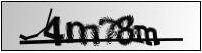
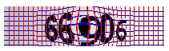
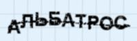
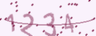
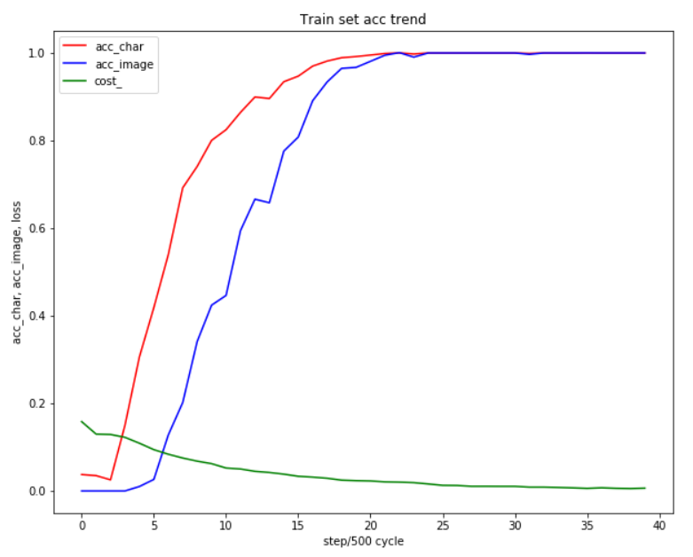
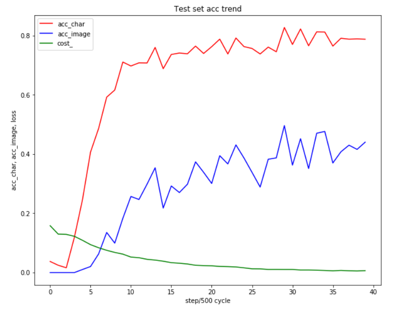
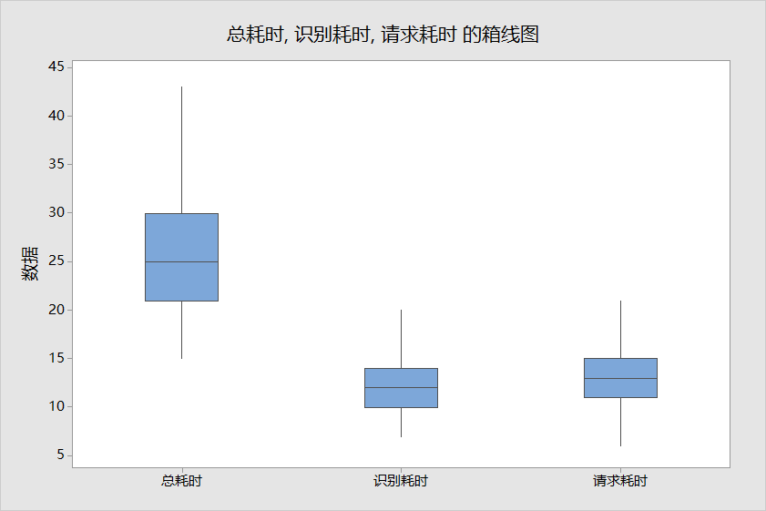
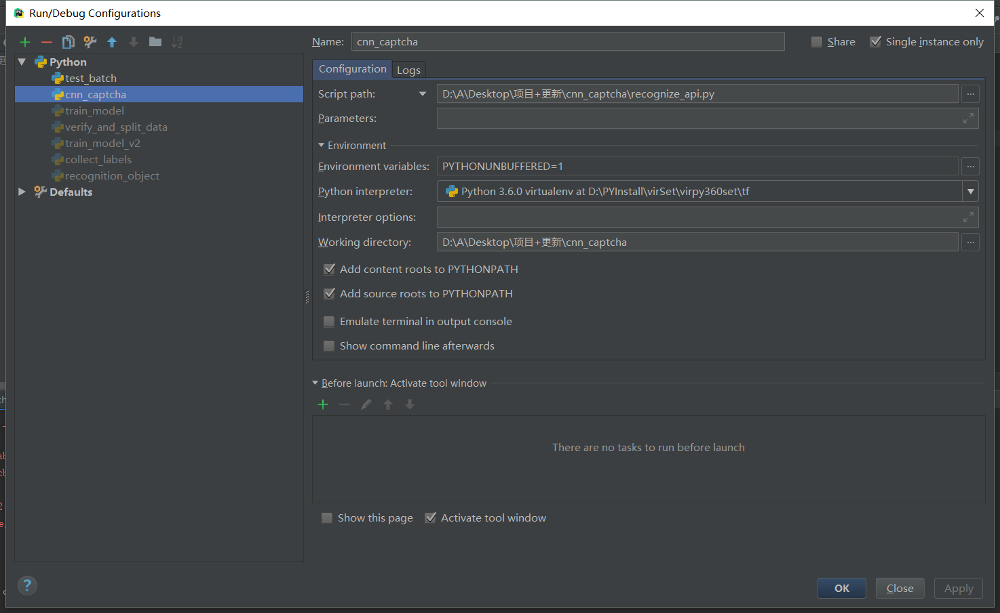

# cnn_captcha
use CNN recognize captcha by tensorflow.  
本项目针对字符型图片验证码，使用tensorflow实现卷积神经网络，进行验证码识别。  
项目封装了比较通用的**校验、训练、验证、识别、API模块**，极大的减少了识别字符型验证码花费的时间和精力。 
  
项目已经帮助很多同学高效完成了验证码识别任务。
如果你在使用过程中出现了bug和做了良好的改进，欢迎提出issue和PR，作者会尽快回复，希望能和你共同完善项目。 

如果你需要识别点选、拖拽类验证码，或者有目标检测需求，也可以参考这个项目[nickliqian/darknet_captcha](https://github.com/nickliqian/darknet_captcha)。

# 时间表
#### 2018.11.12
初版Readme.md  
#### 2018.11.21
加入关于验证码识别的一些说明  
#### 2018.11.24
优化校验数据集图片的规则  
#### 2018.11.26
新增`train_model_v2.py`文件，训练过程中同时输出训练集和验证集的准确率  
#### 2018.12.06
新增多模型部署支持，修复若干bug  
#### 2018.12.08
优化模型识别速度，支持api压力测试和统计耗时  
#### 2019.02.19
1. 新增一种准确率计算方式    
2. TAG: v1.0
#### 2019.04.12
1. 只保留一种`train_model.py`文件
2. 优化代码结构
3. 把通用配置抽取到`sample_config.json`和`captcha_config.json`
4. 修复若干大家在issue提出的问题
#### 2019.06.01
1. 完善readme文档，文档不长，请大家一定要读完~
2. 使用cnnlib目录存放神经网络结构代码
3. 做了一版训练数据统计，大家可以参考我们的训练次数、时长和准确率
4. TAG: v2.0  

# 目录
<a href="#项目介绍">1 项目介绍</a>  
- <a href="#关于验证码识别">1.1 关于验证码识别</a>  
- <a href="#目录结构">1.2 目录结构</a>  
- <a href="#依赖">1.3 依赖</a>  
- <a href="#模型结构">1.4 模型结构</a>  

<a href="#如何使用">2 如何使用</a>  
- <a href="#数据集">2.1 数据集</a>  
- <a href="#配置文件">2.2 配置文件</a>  
- <a href="#验证和拆分数据集">2.3 验证和拆分数据集</a>  
- <a href="#训练模型">2.4 训练模型</a>  
- <a href="#批量验证">2.5 批量验证</a>  
- <a href="#启动WebServer">2.6 启动WebServer</a>  
- <a href="#调用接口识别">2.7 调用接口识别</a>  
- <a href="#部署">2.8 部署</a>  
- <a href="#部署多个模型">2.9 部署多个模型</a>  
- <a href="#在线识别">2.10 在线识别</a>  

<a href="#说明">3 统计数据</a>  
- <a href="#训练数据统计">3.1 训练数据统计</a>  
- <a href="#压力测试">3.2 压力测试</a>  

<a href="#开发说明">4 开发说明</a>  

<a href="#已知BUG">5 已知BUG</a>  


# 1 项目介绍
## 1.1 关于验证码识别
验证码识别大多是爬虫会遇到的问题，也可以作为图像识别的入门案例。目前通常使用如下几种方法：  

| 方法名称 | 相关要点 |
| ------ | ------ |
| tesseract | 仅适合识别没有干扰和扭曲的图片，训练起来很麻烦 |
| 其他开源识别库 | 不够通用，识别率未知 |
| 付费OCR API | 需求量大的情形成本很高 |
| 图像处理+机器学习分类算法 | 涉及多种技术，学习成本高，且不通用 |
| 卷积神经网络 | 一定的学习成本，算法适用于多类验证码 |

这里说一下使用传统的**图像处理和机器学习算法**，涉及多种技术：  

1. 图像处理
- 前处理（灰度化、二值化）
- 图像分割
- 裁剪（去边框）
- 图像滤波、降噪
- 去背景
- 颜色分离
- 旋转
2. 机器学习
- KNN
- SVM

使用这类方法对使用者的要求较高，且由于图片的变化类型较多，处理的方法不够通用，经常花费很多时间去调整处理步骤和相关算法。  
而使用**卷积神经网络**，只需要通过简单的前处理，就可以实现大部分静态字符型验证码的端到端识别，效果很好，通用性很高。  

这里列出目前**常用的验证码**生成库：
>参考：[Java验证全家桶](https://www.cnblogs.com/cynchanpin/p/6912301.html)  

| 语言 | 验证码库名称 | 链接 | 样例 |
| ------ | ------ | ------ | ------ |
| Java | JCaptcha | [示例](https://jcaptcha.atlassian.net/wiki/spaces/general/pages/1212427/Samples+tests)  |    |
| Java | JCaptcha4Struts2 |  |  |
| Java | SimpleCaptcha | [例子](https://www.oschina.net/p/simplecaptcha)   |    |
| Java | kaptcha | [例子](https://github.com/linghushaoxia/kaptcha) |    |
| Java | patchca |  |  |
| Java | imageRandom |  |  |  
| Java | iCaptcha |  |  |  
| Java | SkewPassImage |  |  |  
| Java | Cage |  |   |
| Python | captcha | [例子](https://github.com/nickliqian/cnn_captcha/blob/master/gen_image/gen_sample_by_captcha.py) |  |
| Python | pycapt | [例子](https://github.com/aboutmydreams/pycapt) |  |
| PHP | Gregwar/Captcha | [文档](https://github.com/Gregwar/Captcha) |  |
| PHP | mewebstudio/captcha | [文档](https://github.com/mewebstudio/captcha) |  |

## 1.2 目录结构
### 1.2.1 基本配置
| 序号 | 文件名称 | 说明 |
| ------ | ------ | ------ |
| 1 | `conf/` | 配置文件目录 |
| 2 | `sample/` | 数据集目录 |
| 3 | `model/` | 模型文件目录 |
| 4 | `cnnlib/` | 封装CNN的相关代码目录 |
### 1.2.2 训练模型
| 序号 | 文件名称 | 说明 |
| ------ | ------ | ------ |
| 1 | verify_and_split_data.py | 验证数据集、拆分数据为训练集和测试集 |
| 2 | network.py | cnn网络基类 |
| 3 | train_model.py | 训练模型 |
| 4 | test_batch.py | 批量验证 |
| 5 | gen_image/gen_sample_by_captcha.py | 生成验证码的脚本 |
| 6 | gen_image/collect_labels.py | 用于统计验证码标签（常用于中文验证码） |

### 1.2.3 web接口
| 序号 | 文件名称 | 说明 |
| ------ | ------ | ------ |
| 1 | webserver_captcha_image.py | 获取验证码接口 |
| 2 | webserver_recognize_api.py | 提供在线识别验证码接口 |
| 3 | recognize_online.py | 使用接口识别的例子 |
| 4 | recognize_local.py | 测试本地图片的例子 |
| 5 | recognize_time_test.py | 压力测试识别耗时和请求响应耗时 |

## 1.3 依赖
```
pip install -r requirements.txt
```
注意：如果需要使用GPU进行训练，请把文件中的tenforflow修改为tensorflow-gpu

## 1.4 模型结构

| 序号 | 层级 |
| :------: | :------: |
| 输入 | input |
| 1 | 卷积层 + 池化层 + 降采样层 + ReLU  |
| 2 | 卷积层 + 池化层 + 降采样层 + ReLU  |
| 3 | 卷积层 + 池化层 + 降采样层 + ReLU  |
| 4 | 全连接 + 降采样层 + Relu   |
| 5 | 全连接 + softmax  |
| 输出 | output  |

# 2 如何使用
## 2.1 数据集
原始数据集可以存放在`./sample/origin`目录中。  
为了便于处理，图片最好以`2e8j_17322d3d4226f0b5c5a71d797d2ba7f7.jpg`格式命名（标签_序列号.后缀）。 
  
如果你没有训练集，你可以使用`gen_sample_by_captcha.py`文件生成训练集文件。
生成之前你需要修改相关配置`conf/sample_config.json`（路径、文件后缀、字符集等）。
```
{
  "root_dir": "sample/origin/",  # 验证码保存路径
  "image_suffix": "png",         # 验证码图片后缀
  "characters": "0123456789",    # 生成验证码的可选字符
  "count": 1000,                 # 生成验证码的图片数量
  "char_count": 4,               # 每张验证码图片上的字符数量
  "width": 100,                  # 图片宽度
  "height": 60                   # 图片高度
}
```

## 2.2 配置文件
创建一个新项目前，需要自行**修改相关配置文件**`conf/sample_config.json`。
```
{
  "origin_image_dir": "sample/origin/",  # 原始文件
  "new_image_dir": "sample/new_train/",  # 新的训练样本
  "train_image_dir": "sample/train/",    # 训练集
  "test_image_dir": "sample/test/",      # 测试集
  "api_image_dir": "sample/api/",        # api接收的图片储存路径
  "online_image_dir": "sample/online/",  # 从验证码url获取的图片的储存路径
  "local_image_dir": "sample/local/",    # 本地保存图片的路径
  "model_save_dir": "model/",            # 从验证码url获取的图片的储存路径
  "image_width": 100,                    # 图片宽度
  "image_height": 60,                    # 图片高度
  "max_captcha": 4,                      # 验证码字符个数
  "image_suffix": "png",                 # 图片文件后缀
  "char_set": "0123456789abcdefghijklmnopqrstuvwxyz",  # 验证码识别结果类别
  "use_labels_json_file": false,                       # 是否开启读取`labels.json`内容
  "remote_url": "http://127.0.0.1:6100/captcha/",      # 验证码远程获取地址
  "cycle_stop": 3000,                                  # 启动任务后的训练指定次数后停止
  "acc_stop": 0.99,                                    # 训练到指定准确率后停止
  "cycle_save": 500,                                   # 训练指定次数后定时保存模型
  "enable_gpu": 0                                      # 是否开启GUP训练
}

```
关于`验证码识别结果类别`，假设你的样本是中文验证码，你可以使用`tools/collect_labels.py`脚本进行标签的统计。
会生成文件`gen_image/labels.json`存放所有标签，在配置文件中设置`use_labels_json_file = True`开启读取`labels.json`内容作为`结果类别`。

## 2.3 验证和拆分数据集
此功能会校验原始图片集的尺寸和测试图片是否能打开，并按照19:1的比例拆分出训练集和测试集。  
所以需要分别创建和指定三个文件夹：origin，train，test用于存放相关文件。

也可以修改为不同的目录，但是最好修改为绝对路径。  
文件夹创建好之后，执行以下命令即可：
```
python3 verify_and_split_data.py
```
一般会有类似下面的提示
```
>>> 开始校验目录：[sample/origin/]
开始校验原始图片集
原始集共有图片: 1001张
====以下1张图片有异常====
[第0张图片] [.DStore] [文件后缀不正确]
========end
开始分离原始图片集为：测试集（5%）和训练集（95%）
共分配1000张图片到训练集和测试集，其中1张为异常留在原始目录
测试集数量为：50
训练集数量为：950
>>> 开始校验目录：[sample/new_train/]
【警告】找不到目录sample/new_train/，即将创建
开始校验原始图片集
原始集共有图片: 0张
====以下0张图片有异常====
未发现异常（共 0 张图片）
========end
开始分离原始图片集为：测试集（5%）和训练集（95%）
共分配0张图片到训练集和测试集，其中0张为异常留在原始目录
测试集数量为：0
训练集数量为：0
```
程序会同时校验和分割`origin_image_dir`和`new_image_dir`两个目录中的图片；后续有了更多的样本，可以把样本放在`new_image_dir`目录中再次执行`verify_and_split_data`。  
程序会把无效的文件留在原文件夹。  

此外，当你有新的样本需要一起训练，可以放在`sample/new`目录下，再次运行`python3 verify_and_split_data.py`即可。  
需要注意的是，如果新的样本中有新增的标签，你需要把新的标签增加到`char_set`配置中或者`labels.json`文件中。 
 
## 2.4 训练模型
创建好训练集和测试集之后，就可以开始训练模型了。  
训练的过程中会输出日志，日志展示当前的训练轮数、准确率和loss。  
**此时的准确率是训练集图片的准确率，代表训练集的图片识别情况**  
例如：
```
第10次训练 >>> 
[训练集] 字符准确率为 0.03000 图片准确率为 0.00000 >>> loss 0.1698757857
[验证集] 字符准确率为 0.04000 图片准确率为 0.00000 >>> loss 0.1698757857
```
字符准确率和图片准确率的解释：
```
假设：有100张图片，每张图片四个字符，共400个字符。我们这里把任务拆分为为需要识别400个字符
字符准确率：识别400的字符中，正确字符的占比。
图片准确率：100张图片中，4个字符完全识别准确的图片占比。
```
这里不具体介绍tensorflow安装相关问题，直奔主题。  
确保图片相关参数和目录设置正确后，执行以下命令开始训练：
```
python3 train_model.py
```
也可以根据`train_model.py`的`main`函数中的代码调用类开始训练或执行一次简单的识别演示。  

由于训练集中常常不包含所有的样本特征，所以会出现训练集准确率是100%而测试集准确率不足100%的情况，此时提升准确率的一个解决方案是增加正确标记后的负样本。

## 2.5 批量验证
使用测试集的图片进行验证，输出准确率。  
```
python3 test_batch.py
```
同样可以根据`main`函数中的代码调用类开始验证。

## 2.6 启动WebServer
项目已经封装好加载模型和识别图片的类，启动`web server`后调用接口就可以使用识别服务。  
启动`web server`
```
python3 webserver_recognize_api.py
```
接口url为`http://127.0.0.1:6000/b`

## 2.7 调用接口识别
使用requests调用接口:
```
url = "http://127.0.0.1:6000/b"
files = {'image_file': (image_file_name, open('captcha.jpg', 'rb'), 'application')}
r = requests.post(url=url, files=files)
```
返回的结果是一个json：
```
{
    'time': '1542017705.9152594',
    'value': 'jsp1',
}
```
文件`recognize_local.py`是使用接口识别本地的例子，这个例子运行成功，那么识别验证码的一套流程基本上是走了一遍了。  
在线识别验证码是显示中常用场景，文件`recognize_online.py`是使用接口在线识别的例子，参见：`## 2.11 在线识别`。

## 2.8 部署
部署的时候，把`webserver_recognize_api.py`文件的最后一行修改为如下内容：
```
app.run(host='0.0.0.0',port=5000,debug=False)
```
然后开启端口访问权限，就可以通过外网访问了。  
另外为了开启多进程处理请求，可以使用uwsgi+nginx组合进行部署。  
这部分可以参考：[Flask部署选择](http://docs.jinkan.org/docs/flask/deploying/index.html)

## 2.9 部署多个模型
部署多个模型:
在`webserver_recognize_api.py`文件汇总，新建一个Recognizer对象；  
并参照原有`up_image`函数编写的路由和识别逻辑。
```
Q = Recognizer(image_height, image_width, max_captcha, char_set, model_save_dir)
```
注意修改这一行：
```
value = Q.rec_image(img)
```

## 2.10 在线识别
在线识别验证码是显示中常用场景，即实时获取目标验证码来调用接口进行识别。  
为了测试的完整性，这里搭建了一个验证码获取接口，通过执行下面的命令启动：  
```
python webserver_captcha_image.py
```
启动后通过访问此地址：`http://127.0.0.1:6100/captcha/`可以接收到验证码图片的二进制流文件。  
具体进行在线识别任务的demo参见：`recognize_online.py`。  

# 3 数据统计
## 3.1 训练数据统计
由于很多同学提出，“需要训练多久呀？”、“准确率可以达到多少？”、“为什么我的准确率一直是0？”类似的疑问。  
这一小节，使用默认配置（2019.06.02），把训练过程中的数据做了统计，给大家做一个展示。  
本次测试条件如下：
- 验证码：本项目自带生成验证码程序，数字+小写英文
- 数量：20000张
- 计算引擎：GPU
- GPU型号：笔记本，GTX 950X 2G显卡
  
经过测试：
5000次，25分钟，**训练集**字符准确率84%，图片准确率51%；  
9190次，46分钟，**训练集**字符准确率100%，图片准确率100%；  
12000，60分钟，**测试集**的准确率基本上已经跑不动了。  

使用`test_batch.py`测试，日志如下：  
```
100个样本识别耗时6.513171672821045秒，准确率37.0%
```
有37%的准确率，可以说是识别成功的第一步了。  

曲线图如下：  
训练集-  
 
   
测试集-   
  


## 3.2 压力测试和统计数据
提供了一个简易的压力测试脚本，可以统计api运行过程中识别耗时和请求耗时的相关数据，不过图需要自己用Excel拉出来。  
打开文件`recognize_time_test.py`，修改`main`函数下的`test_file`路径，这里会重复使用一张图片来访问是被接口。  
最后数据会储存在test.csv文件中。  
使用如下命令运行：  
```
python3 recognize_time_test.py
----输出如下
2938,5150,13:30:25,总耗时：29ms,识别：15ms,请求：14ms
2939,5150,13:30:25,总耗时：41ms,识别：21ms,请求：20ms
2940,5150,13:30:25,总耗时：47ms,识别：16ms,请求：31ms
```
这里对一个模型进行了两万次测试后，一组数据test.csv。
把test.csv使用箱线图进行分析后可以看到：  
  
- 单次请求API总耗时（平均值）：27ms  
- 单次识别耗时（平均值）：12ms  
- 每次请求耗时（平均值）：15ms  
其中有：请求API总耗时 = 识别耗时 + 请求耗时  

# 4 开发说明
- 20190209  
1. 目前tensorboard展示支持的不是很好。
- 20190601
1. 最近比较忙，issue回的有点慢，请大家见谅
2. dev分支开发到一半一直没时间弄，今天儿童节花了一下午时间更新了一下:)
3. 感谢看到这里的你，谢谢你的支持

# 4 已知BUG
1. 使用pycharm启动recognize_api.py文件报错
```
2018-12-01 00:35:15.106333: W T:\src\github\tensorflow\tensorflow\core\framework\op_kernel.cc:1273] OP_REQUIRES failed at save_restore_tensor.cc:170 : Invalid argument: Unsuccessful TensorSliceReader constructor: Failed to get matching files on ./model/: Not found: FindFirstFile failed for: ./model : ϵͳ�Ҳ���ָ����·����
; No such process
......
tensorflow.python.framework.errors_impl.InvalidArgumentError: Unsuccessful TensorSliceReader constructor: Failed to get matching files on ./model/: Not found: FindFirstFile failed for: ./model : ϵͳ\udcd5Ҳ\udcbb\udcb5\udcbdָ\udcb6\udca8\udcb5\udcc4·\udcbe\udcb6\udca1\udca3
; No such process
	 [[Node: save/RestoreV2 = RestoreV2[dtypes=[DT_FLOAT, DT_FLOAT, DT_FLOAT, DT_FLOAT, DT_FLOAT, DT_FLOAT, DT_FLOAT, DT_FLOAT, DT_FLOAT, DT_FLOAT], _device="/job:localhost/replica:0/task:0/device:CPU:0"](_arg_save/Const_0_0, save/RestoreV2/tensor_names, save/RestoreV2/shape_and_slices)]]
```
由pycharm默认设置了工作空间，导致读取相对路径的model文件夹出错。
解决办法：编辑运行配置，设置工作空间为项目目录即可。


2. FileNotFoundError: [Errno 2] No such file or directory: 'xxxxxx'  
目录下有文件夹不存在，在指定目录创建好文件夹即可。

3. api程序在运行过程中内存越占越大  
结果查阅资料：[链接](https://blog.csdn.net/The_lastest/article/details/81130500)  
在迭代循环时，不能再包含任何张量的计算表达式，否在会内存溢出。
将张量的计算表达式放到init初始化执行后，识别速度得到极大的提升。

4. 加载多个模型报错
原因是两个Recognizer对象都使用了默认的Graph。
解决办法是在创建对象的时候不使用默认Graph，新建graph，这样每个Recognizer都使用不同的graph，就不会冲突了。

5. Flask程序用于生产
可以参考官方文档：[Flask的生产配置](http://docs.jinkan.org/docs/flask/config.html)
